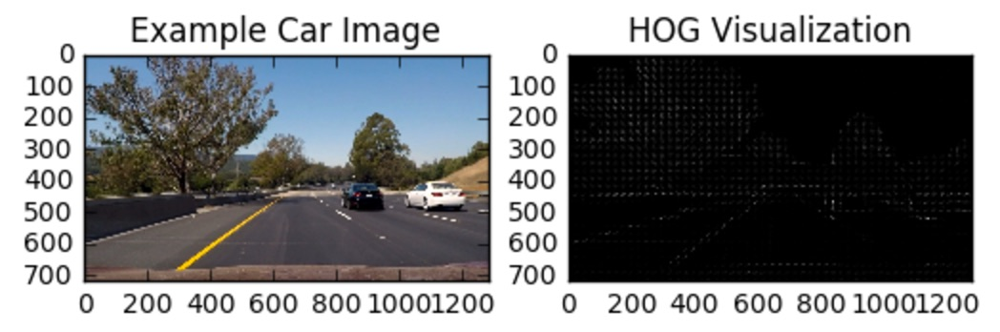

### Vehicle Detection Project

The goals / steps of this project are the following:

* Perform a Histogram of Oriented Gradients (HOG) feature extraction on a labeled training set of images and train a classifier Linear SVM classifier
* Optionally, you can also apply a color transform and append binned color features, as well as histograms of color, to your HOG feature vector.
* Note: for those first two steps don't forget to normalize your features and randomize a selection for training and testing.
* Implement a sliding-window technique and use your trained classifier to search for vehicles in images.
* Run your pipeline on a video stream (start with the test_video.mp4 and later implement on full project_video.mp4) and create a heat map of recurring detections frame by frame to reject outliers and follow detected vehicles.
* Estimate a bounding box for vehicles detected.

## [Rubric](https://review.udacity.com/#!/rubrics/513/view) Points
### Here I will consider the rubric points individually and describe how I addressed each point in my implementation.  

---
| File        | Description           |
| ------------- |:-------------------:|
| `/codebase/Project 5 - Vehicle Detection.ipynb`     | Walkthrough demonstrating steps for image processing pipeline. |
| `/codebase/CarClassifier.py`     | Class for training a classifier or loading pre-defined classifier. |
| `/codebase/HeatMapper.py`     | Class calculates heatmap using binary images from different scales and previous N frames. |
| `/codebase/lesson_functions.py`     | Code with all the utility functions defined as part of the exercises prior to the project. |
| `/codebase/VehicleTracker.py`     | Class to track vehicles uing `CarClassifier`, `HeatMapper`, and `lessons_functions` |
| `/codebase/project_output.mp4`     | Finalized video output. |

---
### Histogram of Oriented Gradients (HOG)
#### 1. Explain how (and identify where in your code) you extracted HOG features from the training images.

After experimenting with various features such spatial histogram, color histogram, histogram of gradients. I chose a feature vector which is combination of all three features mentioned above using `YCbCr` color space.

#### HOG
You can find the code for this in the following locations:

* `lesson_functions.py` >> `get_hog_features` [line 8]
* `lesson_functions.py` >> `extract_features` [lines 84-97]
* `lesson_functions.py` >> `single_img_features` [lines 134-145]

As for the necessary HOG parameters, I settled on:

* Histogram Bins: 32
* Orientations: 9
* Pixels Per Cell: 8
* Cells Per Block: 2

Those parameters can be found within:

* `VehicleTracker.py` >> `pipeline` [lines 23-27]
* `VehicleTracker.py` >> `video_pipeline` [lines 53-57]

Here are some example outputs produced from applying HOG to the project dataset:

##### Test Image Example:

##### Dataset Example:

#### Color Histogram
As mentioned aboved, we incorporated color channel histogram information. I decided on breaking it into 32 bins within (0, 256) range. The logic for this can be found:

* `lesson_functions.py` >> `color_hist ` [lines 38 - 46]
* `lesson_functions.py` >> `extract_features` [lines 80-83]
* `lesson_functions.py` >> `single_img_features` [lines 129-132]

Those parameters can be found within:

* `VehicleTracker.py` >> `pipeline` [lines 27]
* `VehicleTracker.py` >> `video_pipeline` [line 57]

#### Spatial Histogram
As for the spatial information, I resize the image to be `32 x 32` and flatten to a 1D vector. The logic for this can be found:

* `lesson_functions.py` >> `bin_spatial` [lines 29 - 33]
* `lesson_functions.py` >> `extract_features` [lines 77-79]
* `lesson_functions.py` >> `single_img_features` [lines 124-127]

Those parameters can be found within:

* `VehicleTracker.py` >> `pipeline` [line 26]
* `VehicleTracker.py` >> `video_pipeline` [line 56]

#### Combined
The gathering of these features can be found in:

* `lesson_functions.py` >> `extract_features` [lines 51 - 100]

Lots of this logic comes from what was taught within this lesson. As we evolved our understanding of how each feature added to the whole, the eventual outcome was `extract_features`. The total number of columns for each vector of an image comes to be `8460`.

* Spatial Histogram Vector Size >> `32 x 32 x 3` (3072)
* Color Histogram Vector Size >> `32 x 3` (96)
* HOG Vector Size >> `42 x 42 x 3` (5292)

#### 2. Explain how you settled on your final choice of HOG parameters.
I believe `#1` answers this question.

#### 3. Describe how (and identify where in your code) you trained a classifier using your selected HOG features (and color features if you used them).

Prior to training the data, the approriate features are needed to be extracted. Once those necessary features were extracted, we need to approriately scale the data using `StandardScaler`. The reason for that is because we want to avoid one feature dominating any other features. The data is then split into training and validation sets using `sklearn`'s `train_test_split`. Now we are able to train and test accuracy. Since this falls under Classification, I went with what we were taught in the lesson and used Linear SVC to train our classifier.

To improve performance, I stored the classifier in a Python pickle file. When we instantiate the Classifier inside `VehicleTracker.py`, the parameters for the classifier are loaded from the Python pickle file.

The codebase for the classifier can be found at:

* `/codebase/CarClassifier.py`
* `/codebase/VehicleTracker.py` >> `init` [line 10]
* `/codebase/dependencies/car_classifier.pkl`
* `/codebase/dependencies/car_feature_scaler.pkl`

---
### Sliding Window Search
#### 1. Describe how (and identify where in your code) you implemented a sliding window search. How did you decide what scales to search and how much to overlap windows?

I used the sliding window approached discussed in the lesson. Different scaling can be useful becasue it all allows us to approximate a vehicle size we expect in different frame regions. This can make searching much easier. The scaling parameters are `0.75` to `1.5` for the processing pipeline (`/codebase/VehicleTracker.py` >> `video_pipeline`). The image below displays the sliding windows across each image, where each sub-image in each box is going to be either "vehicle" or "non-vehicle" using our trained classifer.

Because frame segments must be of various size, we eventually need to use `64 × 64` regions as a classifier input. So I went about simply scaling the frame to various size and then scanned them with a `64 x 64` window, which you can see below. Note that the image below is of scale `1.5`.

The codebase for this can be found at:

* `/codebase/VehicleTracker.py` >> `detect_cars` [line 80-152]
* `/codebase/VehicleTracker.py` >> `pipeline` [line 21]
* `/codebase/VehicleTracker.py` >> `video_pipeline` [line 46, line 50]

#### 2. Show some examples of test images to demonstrate how your pipeline is working. What did you do to optimize the performance of your classifier?
I believe `#1` in Sliding Window Search may have answered this question. One thing to add though is that within the color histogram, finding that right color space really improved the performance of the classifer. `RGB` vs. `LUV`, for example, `RGB` gave a better result. In the end though, `YCrCb` gave us the better result.  

---
### Video Implementation
#### 1. Provide a link to your final video output.  Your pipeline should perform reasonably well on the entire project video (somewhat wobbly or unstable bounding boxes are ok as long as you are identifying the vehicles most of the time with minimal false positives.)
Here's a [link to my video result](./codebase/project_output.mp4).

#### 2. Describe how (and identify where in your code) you implemented some kind of filter for false positives and some method for combining overlapping bounding boxes.

I used the heatmap technique that was presented in the lesson to find overlapping bounding boxes. As for the outliers, we look at the last N frames - N is chosen as 10 - and those objects which are consistent in some of the frames. Because there are multiple detections on different scales and overlapping windows, we need to merge nearby detections. To do that, we calculate a heatmap of intersection regions that were classified as containing vehicles. We then have to merge heatmaps from multiple scales and frames, allowing us to threshold the heatmap. We use the `label()` module to detect indiviudal groups of detectsion and caclualte the bounding rectangular region for each of them.

* `/codebase/HeatMapper.py`
* `/codebase/HeatMapper.py` >> `compute_heatmap` [line 53-67]
* `/codebase/VehicleTracker.py` >> `pipeline` [line 37-39]
* `/codebase/VehicleTracker.py` >> `video_pipeline` [line 74-77]

---
### Discussion
#### 1. Briefly discuss any problems / issues you faced in your implementation of this project. Where will your pipeline likely fail? What could you do to make it more robust?

The problems / issues I faced were mainly around heatmap and scaling. Heatmap took me a while to get a hang of, that turned out to be simpler than I thought. Scaling still somewhat gives me a whirlwind but I think I got the grasp of it. We were able to find cars that were further/closer and smaller by scaling up and down the region.

As like the other projects, I wander if what we have built will work in all conditions. I don't know if we have the right color space if it wasn't a sunny day.
